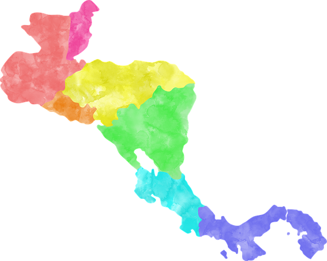

    

# Central American Countries
Learn 5 things about each Central American Country:
- Guatemala 🇬🇹
- Belize 🇧🇿
- El Salvador 🇸🇻
- Honduras 🇭🇳
- Nicaragua 🇳🇮
- Costa Rica 🇨🇷
- Panama 🇵🇦

## Project setup

- Clone the project

- Install the dependencies vith `npm install`

- Running the project: `npm run serve`

- Go to `localhost:8080` on your browser and start learning !

### References
- The articles are inspired by Wikipedia articles of the countries: https://www.wikipedia.org/
- The images are from Pixabay: https://pixabay.com/
- Inspired by: https://github.com/bradtraversy/50projects50days/tree/master/expanding-cards
