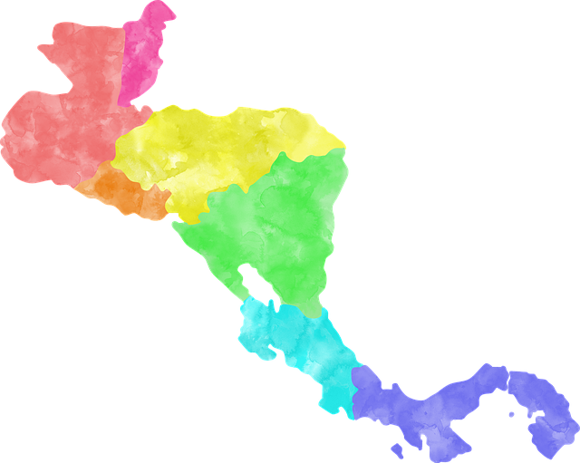

    

# Central American Countries
Learn 5 things about each Central American Country:
- Guatemala 🇬🇹
- Belize 🇧🇿
- El Salvador 🇸🇻
- Honduras 🇭🇳
- Nicaragua 🇳🇮
- Costa Rica 🇨🇷
- Panama 🇵🇦

## Project setup

Plain HTML, CSS and JavaScript: no framework, no dependencies, no build step.

- Clone the project

- Serve the folder with any static server (ES modules and JSON imports need HTTP, not `file://`), for example `npx serve` or the VS Code Live Server extension

- Open the served URL in your browser and start learning !

### References
- The articles are inspired by Wikipedia articles of the countries: https://www.wikipedia.org/
- The images are from Pixabay: https://pixabay.com/
- Inspired by: https://github.com/bradtraversy/50projects50days/tree/master/expanding-cards
